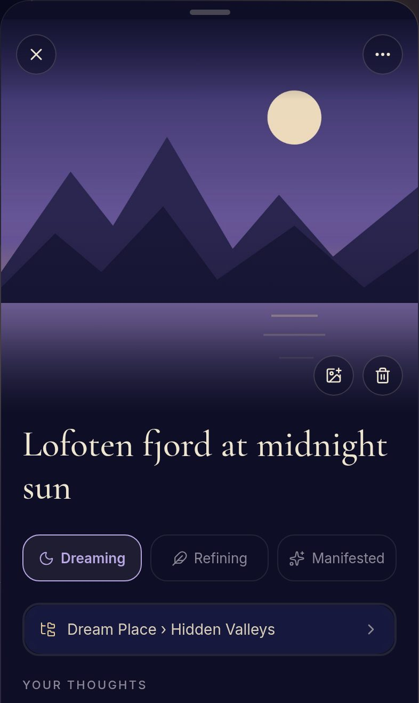
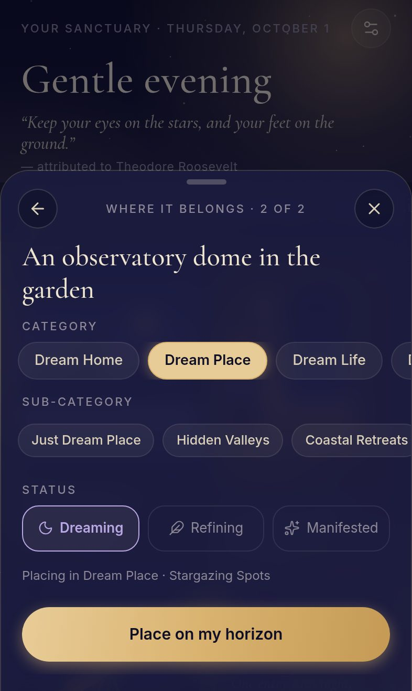
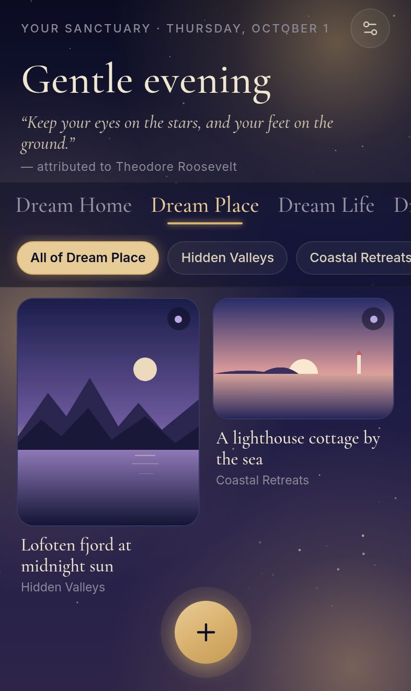

# Ethereal

A private, offline-first **dream vision board**: a quiet place for solitude, reflection and
curating your horizon. Ethereal is a native iPhone (and Android) app built with React Native and
Expo. The same code also ships as an installable web app, published on this repository's own
GitHub Pages site.

**[Open the web app](https://archanakumar-github.github.io/ethereal/)**. On iPhone, tap
**Share → Add to Home Screen** and it opens full-screen and works offline.

| The board | Sanctuary view | Quick Add, step 2 | A category |
|---|---|---|---|
|  |  |  |  |

> **Night Sanctuary** theme: a deep indigo sky with drifting gold and lavender glows, aged-parchment
> serif type (Cormorant Garamond), clean Inter for anything functional, frosted-glass surfaces and
> soft spring motion.

## Features

| | |
|---|---|
| **Board** | A time-of-day greeting ("Quiet morning", "Gentle evening"…) and a quote that changes daily (tap it for another one). Below that is a masonry grid where each card keeps its photo's own shape, and cards drift in and out with spring layout animations. Desires without a photo appear as serif "journal" cards. |
| **Categories** | **All**, then the five pre-loaded categories, each with four sub-categories: Dream Home, Dream Place, Dream Life, Dream Materials, Dream Bookshelf. Tap a tab or **swipe the grid sideways** to move between them. Sub-category pills drill down to **any depth**. |
| **Curate categories** | Add, rename, reorder or delete any category or sub-category. **+ Sub-category** pills appear inline everywhere you choose a category. Long-press a tab or pill for quick actions. Drag handles reorder lists in the category manager. Deleting a category never deletes desires: they move up to the parent category, or to "Unsorted" if there is no parent. |
| **Quick Add portal** | The golden orb opens it. On iPhone you can also **pull the board down**. Step 1: type a title, paste a link, or choose or take a photo. Step 2: pick a category and sub-category from scrollable pills, plus a status. A smart default is pre-selected (a telescope goes to *Astronomy Equipment*, an ISBN to the *Bookshelf*). Save is always instant. |
| **Online enrichment** | When online, a pasted link fills in its page's picture, title, description and price (from Open Graph, Twitter cards or JSON-LD). Book titles and ISBNs get covers and details from Google Books, with Open Library covers as a fallback. Places get a photo and summary from Wikipedia. Lookups only fill gaps and never overwrite what you wrote. Fetched images are saved to the device so they show offline. |
| **Sanctuary view** | A calm full-screen page for one desire: a large photo, the title, your thoughts, status (**Dreaming → Refining → Manifested**), category path, tags, link, the description found online, and the date it was added. Every field edits in place with one tap and saves as you type. Swipe down to close. |
| **Quick actions** | Long-press any card: open, edit, re-categorize, change status, open its link, or delete. |
| **One-tap delete** | The desire disappears at once and an **Undo** bar stays for exactly 5 seconds. |
| **Haptics & gestures** | Soft haptics on taps, long-presses, drags and saves. Every sheet closes with a swipe down. Respects *Reduce Motion*. |
| **Backups** | Settings → Export creates a single JSON file with photos included, saved through the share sheet. Restore replaces everything from a backup. |

## Privacy and offline

- No account, no analytics, no cloud. Everything lives in a SQLite database and an images folder
  that only this app can read.
- Every add, edit and delete is written locally first, so it works in airplane mode. Lookups
  that were missed while offline run when the connection returns.
- Online lookups send only the link or title. You can switch them off in Settings.
- Photos are downscaled to 1600 px and re-encoded as JPEG when saved, which also strips their
  location metadata.

## Run it

```bash
cd ethereal
npm install
npm test             # unit tests (Vitest, real SQLite via node:sqlite)
npm run typecheck
npm run web          # the app in a browser: the quickest way to try it
npm run build:web    # production web build to dist/ (+ offline service worker)
```

Node 20.19+ (22 recommended).

### On your iPhone (native)

| You have | Do this |
|---|---|
| Just an iPhone | Install **Expo Go** from the App Store, run `npx expo start` on your computer and scan the QR code with the Camera app. Every module Ethereal uses is included in Expo Go. |
| A Mac with Xcode | `npx expo run:ios --device` builds a standalone app and installs it on your plugged-in iPhone. |
| No Mac, but you want an app icon on your Home Screen | `npx eas-cli@latest build -p ios --profile preview` builds in the cloud (needs an Apple Developer account). Install it from the link EAS gives you. `--profile production` plus `eas submit` sends it to TestFlight. |
| Android | Expo Go works the same way, or `eas build -p android --profile preview` gives an installable APK. |

**Bare workflow.** The native `ios/` and `android/` projects are generated from `app.config.ts`
by `npx expo prebuild` (Continuous Native Generation), so they are not committed. To work in Xcode
directly, run `npx expo prebuild` once, remove `/ios` and `/android` from `.gitignore`, and
commit them.

## Tech stack

- **Expo SDK 57** (React Native 0.86, New Architecture, React 19.2), TypeScript (strict).
- **expo-sqlite** on iOS and Android. In the browser, the same SQL runs on **sql.js** (SQLite in
  WebAssembly), saved to IndexedDB. Expo's own web SQLite needs `SharedArrayBuffer`, which needs
  response headers GitHub Pages can't send.
- **React Native Reanimated 4** + **Gesture Handler**: springs, layout animations, swipe-to-dismiss,
  drag-to-reorder. (Reanimated 4 is the version SDK 57 ships. It keeps Reanimated 3's API:
  shared values, `withSpring`, layout animations.)
- **expo-blur** (`BlurView`) glass, **expo-linear-gradient**, **react-native-svg** for the sky,
  **expo-image** with a memory + disk cache, **expo-image-picker** / **-manipulator**,
  **expo-file-system**, **expo-haptics**, **expo-network**, **lucide-react-native** icons (imported one
  file each), and **Cormorant Garamond** + **Inter** via `@expo-google-fonts`.
- No navigation library: one board plus a stack of sheets (`src/state/ui.ts`).

## Project structure

```
ethereal/
├── app.config.ts            # name, icons, permissions, plugins; EXPO_BASE_URL for the web build
├── index.ts                 # entry
├── public/                  # web only: HTML template, manifest, service worker, icons
├── scripts/finalize-web.mjs # writes the precache list + version into dist/sw.js
├── assets/                  # app icon, splash, Android adaptive icon (source: assets/source/icon.svg)
├── tests/                   # Vitest: repository, tree, enrichment, suggestions, layout, text
└── src/
    ├── App.tsx              # fonts, splash, network watcher, root providers
    ├── theme/               # palette, fonts, spacing, status colours, springs
    ├── db/
    │   ├── types.ts         # Category, Item, ItemStatus…
    │   ├── driver.ts        # the SqlDriver interface (+ a write mutex)
    │   ├── openDriver.ts    # iOS/Android: expo-sqlite
    │   ├── openDriver.web.ts# browser: sql.js + IndexedDB, multi-tab aware
    │   ├── schema.ts        # migrations (PRAGMA user_version)
    │   ├── seed.ts          # the five default categories and their sub-categories
    │   └── repo.ts          # every query: CRUD, reorder, cascades, soft delete, backup
    ├── enrich/              # Open Graph / Microlink, Google Books + Open Library, Wikipedia
    ├── images/              # photo storage: files (native) or IndexedDB blobs (web)
    ├── state/               # library store + actions (optimistic writes), UI store (sheets, toasts)
    ├── lib/                 # pure helpers: tree, masonry, greeting, suggest, text, haptics…
    ├── components/          # Backdrop, Glass, Sheet, ItemCard, MasonryGrid, SubPills, SortableList…
    ├── sheets/              # Quick Add, Sanctuary view, quick actions, re-categorize, categories, settings
    └── screens/HomeScreen.tsx
```

## Architecture notes

### Storage

| Table | Columns | Notes |
|---|---|---|
| `categories` | `id`, `parent_id`, `name`, `kind`, `position` | `parent_id = NULL` is a top-level category; anything else is a sub-category at any depth. `kind` marks the five built-ins, so the Bookshelf is still recognised after it is renamed. |
| `items` | `id`, `title`, `notes`, `description`, `url`, `image_uri`, `image_aspect`, `status`, `category_id`, `tags` (JSON), `meta` (JSON), `enrich_state`, `created_at`, `updated_at`, `deleted_at` | `deleted_at` is set during the 5-second undo window and purged afterwards (or at the next launch). |
| `kv` | `key`, `value` | Settings. |

Writes are optimistic: memory updates in the same frame, then SQLite is written. If a write ever
fails, the app reloads from the database and shows a toast. Photos are stored as
`local:<file>.jpg` rather than absolute paths, because iOS moves an app's container on every
update.

### Enrichment

A desire is looked up automatically when it has a link, when it is filed under the Bookshelf
(or is an ISBN), or when it is filed under Dream Place. **Find details online** in the
sanctuary view tries every source on demand. iOS and Android read pages directly. Browsers
can't read other sites' HTML (CORS), so the web build asks [Microlink](https://microlink.io)
for link previews; its free tier allows about 50 previews a day. Books and places work directly in
every build.

### Publishing the web build

[`.github/workflows/pages.yml`](.github/workflows/pages.yml) type-checks, tests and builds the
web app on every pull request, and on every push to `main` also publishes it to this repository's
own GitHub Pages site at `https://<user>.github.io/<repo>/` (one-time step: **Settings → Pages →
Source: GitHub Actions**). It is deployed independently of any other app. To build by hand for a
sub-path, run `EXPO_BASE_URL=/<repo> npm run build:web`.

Every GitHub Pages project site of an account shares one origin (`<user>.github.io`), so the web
build never touches anything outside its own folder and names:

- Its service worker is registered with scope `./`, so it controls only `/<repo>/`.
- Every cache it creates or deletes starts with `ethereal-`.
- Its data is in its own IndexedDB database, `ethereal`. It uses no `localStorage`.

## Tests

`npm test` runs 50 unit tests. They cover first-launch seeding, category CRUD at any depth,
reordering, moving and cycle protection, cascading deletes that keep items, item CRUD, the
soft-delete/undo/purge cycle, settings, backup round-trips and transaction rollback (all against
real SQLite through `node:sqlite`). They also cover Open Graph / JSON-LD / Microlink parsing,
Google Books matching and mapping, Wikipedia matching, lookup routing, the never-overwrite merge
rules, category suggestions, masonry layout, greetings and quotes, and URL/ISBN/text helpers.

The web build was also driven end to end in Chromium at iPhone size: adding with photos and
links, editing in place, the long-press menu, delete with Undo, swiping between categories, the
category manager, reloads, and opening offline.
